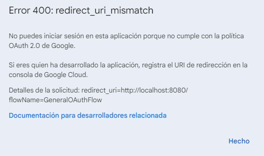

# Google SpreadSheet
  
Este módulo le permite leer, escribir y actualizar hojas de cálculo de Google. Puede agregar, eliminar, duplicar o incluso ocultar hojas; filtrar datos; agregar o eliminar filas y columnas; modificar el formato de las celdas, copiarlas/cortarlas y pegarlas; y más.  

*Read this in other languages: [English](Manual_Google-SpreadSheets.md), [Português](Manual_Google-SpreadSheets.pr.md), [Español](Manual_Google-SpreadSheets.es.md)*
  

## Como instalar este módulo
  
Para instalar el módulo en Rocketbot Studio, se puede hacer de dos formas:
1. Manual: __Descargar__ el archivo .zip y descomprimirlo en la carpeta modules. El nombre de la carpeta debe ser el mismo al del módulo y dentro debe tener los siguientes archivos y carpetas: \__init__.py, package.json, docs, example y libs. Si tiene abierta la aplicación, refresca el navegador para poder utilizar el nuevo modulo.
2. Automática: Al ingresar a Rocketbot Studio sobre el margen derecho encontrara la sección de **Addons**, seleccionar **Install Mods**, buscar el modulo deseado y presionar install.  

## Como usar este modulo

Antes de usar este módulo, debe registrar su aplicación en Google Cloud Portal.

1. Inicie sesión con una cuenta de Google y acceda al siguiente enlace: https://console.cloud.google.com/projectcreate?previousPage=%2Fhome%2Fdashboard
2. Complete el formulario para crear un nuevo proyecto y luego presione "Crear".
3. Dentro del menú de navegación (izquierda), acceda a API y servicios.
4. Ve a la sección superior y presiona "+ HABILITAR API Y SERVICIOS".
5. Busque "Google Sheets API", selecciónelo y luego presione "HABILITAR".
6. Vuelva al menú de navegación, vaya a API y servicios y luego acceda a Credenciales.
7. Pulse Crear credenciales y seleccione ID de cliente de OAuth. Luego seleccione Tipo de aplicación: Aplicación de escritorio, asígnele un nombre y presione Crear.
8. Descargue el archivo JSON de credenciales.
9. Finalmente, vuelve al Menú de Navegación, ve a la Pantalla de Consentimiento y agrega tu usuario en la sección "Usuarios de prueba" (aunque 
sea el mismo que está creando la aplicación).

Nota: Cuando se realiza la primera conexión, se creará un archivo .pickle en la carpeta raíz de Rocketbot, para conectarse al mismo servicio con otra cuenta, debe asignar un nombre a cada sesión. Si las credenciales caducan, debe eliminar el archivo .pickle y crear y descargar un archivo de credenciales nwe (JSON).

## ERROR REDIRECT_URI_MISMATCH

Si aparece el siguiente error al utilizar un archivo .json de credenciales que estaba funcional:

Se deberán crear las credenciales nuevamente. Antes del paso 6 del apartado anterior 'Como usar este modulo', se tiene que configurar lo siguiente:
- Ir a 'Pantalla de Consentimiento de OAuth' del menú izquierdo
- Elegir el Tipo de Usuario:
    1. Interno: los proyectos asociados con una organización de Google Cloud pueden configurar usuarios internos para limitar las solicitudes de autorización a los miembros de la organización.
    2. Externo: 
disponibles para cualquier usuario con una cuenta de Google.
       
        Hacer click en Crear
- Completar los datos obligatorios marcados con asterisco (*) en la pagina Información de la aplicación, como el Nombre de la Aplicación, el Correo Electrónico de asistencia del usuario y la información de contacto del desarrollador. Hacer click en Guardar y continuar.
- Seguir desde el paso 6 indicado en esta sección para concluir.

## Descripción de los comandos

### Configurar credenciales G-Suite
  
Obtiene los permisos para manejar Google SpreadSheet con Rocketbot
|Parámetros|Descripción|ejemplo|
| --- | --- | --- |
|Ruta del archivo de credenciales|Archivo JSON con las credenciales de acceso a la API de Google SpreadSheets.|C:/ruta/a/credenciales.json|
|Puerto (Opcional)||8080|
|Session||session|

### Iniciar sesión sin archivo json
  
Iniciar sesión en Google Drive sin archivo json
|Parámetros|Descripción|ejemplo|
| --- | --- | --- |
|Client ID|ID de cliente de la consola de Google Cloud Platform.|123456789012-xxxxxxxxxxxxxxx.apps.googleusercontent.com|
|Client Secret|Secreto de cliente de la consola de Google Cloud Platform.|GOCSPX-xxxxxxxxx_Dc9TGFy32_xxxxxxxx|
|Puerto (Opcional)||8080|
|Session||session|

### Crear Hoja de Cálculo
  
Crea una nueva hoja de cálculo en Google SpreadSheet
|Parámetros|Descripción|ejemplo|
| --- | --- | --- |
|Nombre de la hoja de cálculo||Nombre|
|Variable donde se guardará el ID||Variable|
|Session||session|

### Crear Hoja
  
Crear una nueva hoja en la Hoja de Cálculo seleccionada
|Parámetros|Descripción|ejemplo|
| --- | --- | --- |
|Spreadsheet ID||Spreadsheet ID|
|Nombre de la hoja||Nombre|
|Session||session|

### Actualizar propiedades de Hoja
  
Actualiza las propiedades de una hoja de la Hoja de Cálculo seleccionada
|Parámetros|Descripción|ejemplo|
| --- | --- | --- |
|Spreadsheet ID||Spreadsheet ID|
|Nombre de la hoja a actualizar||Nombre de la hoja|
|Nuevo Nombre (Opcional)||Nuevo|
|Ocultar hoja||False|
|Session||session|

### Borrar Hoja
  
Elimina una hoja de la Hoja de Cálculo seleccionada
|Parámetros|Descripción|ejemplo|
| --- | --- | --- |
|Spreadsheet ID||Spreadsheet ID|
|Nombre de la hoja a borrar||Nombre de la hoja|
|Session||session|

### Escribir en celdas
  
Escribe en una celda o rango de celdas en la Hoja de Cálculo seleccionada
|Parámetros|Descripción|ejemplo|
| --- | --- | --- |
|Spreadsheet ID||Spreadsheet ID|
|Nombre de la hoja||Hoja1|
|Celda a escribir ||A1|
|Texto ||[["data","data"],["data","data"]]|
|Tipo de envio de datos||USER_ENTERED|
|Session||session|

### Formatear celdas
  
Cambiar formato de una celda o rango de celdas en la hoja de cálculo seleccionada
|Parámetros|Descripción|ejemplo|
| --- | --- | --- |
|Spreadsheet ID||Spreadsheet ID|
|Nombre de la hoja||Hoja1|
|Celdas a formatear ||A1:C1|
|Combinar celdas|||
|Separar celdas|||
|Ajustar tamaño de columnas|||
|Tipo de formato||---- Select type ----|
|Patron de formato ||yyyy-mm-dd hh:mm A/P".M."|
|Color de fuente ||255,0,0|
|Tipo de fuente ||Open Sans|
|Tamaño de fuente ||12|
|Negrita|||
|Cursiva|||
|Tachar|||
|Subrayar|||
|Session||session|

### Leer celdas
  
Lee una celda o rango de celdas desde la Hoja de Cálculo seleccionada, ejemplo A1 o A1:B5
|Parámetros|Descripción|ejemplo|
| --- | --- | --- |
|Spreadsheet ID||Spreadsheet ID|
|Nombre de la hoja||Hoja1|
|Celda o rango de celdas ||A1|
|Resultado||Variable|
|Session||session|

### Copiar/cortar y pegar
  
Copie o corte y pegue una celda o rango de celdas en la Hoja de Cálculo seleccionada
|Parámetros|Descripción|ejemplo|
| --- | --- | --- |
|Spreadsheet ID||Spreadsheet ID|
|Nombre de la hoja origen||Hoja1|
|Celdas origen ||A1:C1|
|Nombre de la hoja destino||Hoja2|
|Celdas destino ||A2:C2|
|Tipo de pegado||---- Select type ----|
|Transponer|||
|Cortar|||
|Session||session|

### Obtener hojas
  
Obtener lista de hojas con su ID de la Hoja de Cálculo seleccionada
|Parámetros|Descripción|ejemplo|
| --- | --- | --- |
|Spreadsheet ID||Spreadsheet ID|
|Resultado||Variable|
|Session||session|

### Contar filas y/o columnas
  
Cuenta las filas y/o columnas utilizadas de la hoja seleccionada
|Parámetros|Descripción|ejemplo|
| --- | --- | --- |
|Spreadsheet ID||Spreadsheet ID|
|Nombre de la hoja||Hoja1|
|Rango ||A1:A100|
|Variable donde almacenar resultado de filas||Variable|
|Variable donde almacenar resultado de columnas||Variable|
|Session||session|

### Agregar columna
  
Agregar columnas a la Hoja de Cálculo seleccionada
|Parámetros|Descripción|ejemplo|
| --- | --- | --- |
|Spreadsheet ID||Spreadsheet ID|
|Nombre de la hoja||Hoja1|
|Columna||A|
|Cantidad||Cantidad|
|Mantener formato|||
|Session||session|

### Agregar fila
  
Agregar filas a la Hoja de Cálculo seleccionada
|Parámetros|Descripción|ejemplo|
| --- | --- | --- |
|Spreadsheet ID||Spreadsheet ID|
|Nombre de la hoja||Hoja1|
|Fila||5|
|Cantidad||Cantidad|
|Mantener formato|||
|Session||session|

### Eliminar columna
  
Elimina una columna de una Hoja de Cálculo seleccionada
|Parámetros|Descripción|ejemplo|
| --- | --- | --- |
|Spreadsheet ID||Spreadsheet ID|
|Nombre de la hoja||Hoja1|
|Columna/as||A:C|
|Dejar en blanco|||
|Session||session|

### Eliminar fila
  
Elimina una fila de una Hoja de Cálculo seleccionada
|Parámetros|Descripción|ejemplo|
| --- | --- | --- |
|Spreadsheet ID||Spreadsheet ID|
|Nombre de la hoja||Hoja1|
|Fila||5:7|
|Dejar en blanco|||
|Session||session|

### Filtrar datos
  
Filtrar datos en la Hoja de Cálculo seleccionada
|Parámetros|Descripción|ejemplo|
| --- | --- | --- |
|Spreadsheet ID||Spreadsheet ID|
|Nombre de la hoja||Hoja1|
|Columna||Columna|
|Valor||Valor a filtrar|
|Session||session|

### Desfiltrar datos
  
Desfiltrar datos en la Hoja de Cálculo seleccionada
|Parámetros|Descripción|ejemplo|
| --- | --- | --- |
|Spreadsheet ID||Spreadsheet ID|
|Nombre de la hoja||Hoja1|
|Session||session|

### Obtener celdas filtradas
  
Obtiene las celdas filtradas
|Parámetros|Descripción|ejemplo|
| --- | --- | --- |
|Spreadsheet ID||Spreadsheet ID|
|Nombre de la hoja||Hoja1|
|Rango||A1:B2|
|Obtener datos con número de fila|||
|Resultado||Variable|
|Session||session|

### Duplicar hoja
  
Duplica la hoja seleccionada al mismo o a otro libro
|Parámetros|Descripción|ejemplo|
| --- | --- | --- |
|Spreadsheet ID||Spreadsheet ID|
|Nombre de la hoja||Hoja1|
|Spreadsheet ID||Spreadsheet ID|
|Resultado||Variable|
|Session||session|

### Texto a columnas
  
Divide una columna de texto en varias columnas, en función de un delimitador en cada celda.
|Parámetros|Descripción|ejemplo|
| --- | --- | --- |
|Spreadsheet ID||Spreadsheet ID|
|Nombre de la hoja||Hoja1|
|Separador||---- Select separator ----|
|Resultado||Variable|
|Session||session|
