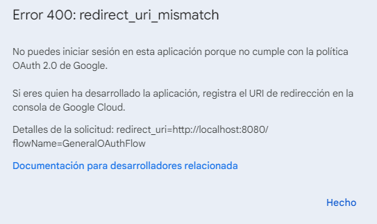

## How to use this module

Before using this module, you must register your app into Google Cloud Portal.

1. Sign in with a google account and get into the following link: https://console.cloud.google.com/projectcreate?previousPage=%2Fhome%2Fdashboard
2. Complete the form to create a new proyect and then press "Create".
3. Within the Navigation Menu (Left), get into API and Services.
4. Go to the upper section and press "+ ENABLE API AND SERVICES".
5. Search for "Google Sheets API", select it and then press "ENABLE".
6. Go back to the Navigation Menu, go to API and Services and then get into Credentials.
7. Press Create Credentials and select OAuth Client ID. Then select Application Type: Desktop App, give it a name and press Create.
8. Download the credentials JSON file.
9. Finally, go back to the Navigation Menu, go to Consent Screen and add your user in the "Test Users" section (even if it is the same that is creating the app).

Note: When the first connection is made, a .pickle file will be created in the Rocketbot root folder, to connect to the same service with another account you must give each session a name. If credentials expire you must delete the .pickle file and create and download a nwe credentials (JSON) file.

## ERROR REDIRECT_URI_MISMATCH

If you receive the following error when using a previously functional credentials .json file:

Credentials will need to be created again. Before step 6 of the previous section 'How to use this module', the following must be configured:
- Go to 'OAuth Consent Screen' from the left menu
- Choose the User Type:
    1. Internal: Projects associated with a Google Cloud organization can configure internal users to limit authorization requests to members of the organization.
    2. External: available to any user with a Google account.
       
        Click on Create
- Complete the mandatory data marked with an asterisk (*) on the Application Information page, such as the Application Name, the user's support Email, and the developer's contact information. Click Save and continue.
- Continue from step 6 indicated in this section to conclude.
---

## Como usar este modulo

Antes de usar este módulo, debe registrar su aplicación en Google Cloud Portal.

1. Inicie sesión con una cuenta de Google y acceda al siguiente enlace: https://console.cloud.google.com/projectcreate?previousPage=%2Fhome%2Fdashboard
2. Complete el formulario para crear un nuevo proyecto y luego presione "Crear".
3. Dentro del menú de navegación (izquierda), acceda a API y servicios.
4. Ve a la sección superior y presiona "+ HABILITAR API Y SERVICIOS".
5. Busque "Google Sheets API", selecciónelo y luego presione "HABILITAR".
6. Vuelva al menú de navegación, vaya a API y servicios y luego acceda a Credenciales.
7. Pulse Crear credenciales y seleccione ID de cliente de OAuth. Luego seleccione Tipo de aplicación: Aplicación de escritorio, asígnele un nombre y presione Crear.
8. Descargue el archivo JSON de credenciales.
9. Finalmente, vuelve al Menú de Navegación, ve a la Pantalla de Consentimiento y agrega tu usuario en la sección "Usuarios de prueba" (aunque sea el mismo que está creando la aplicación).

Nota: Cuando se realiza la primera conexión, se creará un archivo .pickle en la carpeta raíz de Rocketbot, para conectarse al mismo servicio con otra cuenta, debe asignar un nombre a cada sesión. Si las credenciales caducan, debe eliminar el archivo .pickle y crear y descargar un archivo de credenciales nwe (JSON).

## ERROR REDIRECT_URI_MISMATCH

Si aparece el siguiente error al utilizar un archivo .json de credenciales que estaba funcional:

Se deberán crear las credenciales nuevamente. Antes del paso 6 del apartado anterior 'Como usar este modulo', se tiene que configurar lo siguiente:
- Ir a 'Pantalla de Consentimiento de OAuth' del menú izquierdo
- Elegir el Tipo de Usuario:
    1. Interno: los proyectos asociados con una organización de Google Cloud pueden configurar usuarios internos para limitar las solicitudes de autorización a los miembros de la organización.
    2. Externo: disponibles para cualquier usuario con una cuenta de Google.
       
        Hacer click en Crear
- Completar los datos obligatorios marcados con asterisco (*) en la pagina Información de la aplicación, como el Nombre de la Aplicación, el Correo Electrónico de asistencia del usuario y la información de contacto del desarrollador. Hacer click en Guardar y continuar.
- Seguir desde el paso 6 indicado en esta sección para concluir.

---

## Como usar este módulo

Antes de usar este módulo, você deve registrar seu aplicativo no Google Cloud Portal.

1. Faça login com uma conta do Google e entre no seguinte link: https://console.cloud.google.com/projectcreate?previousPage=%2Fhome%2Fdashboard
2. Preencha o formulário para criar um novo projeto e pressione "Criar".
3. No Menu de Navegação (Esquerda), entre em API e Serviços.
4. Vá para a seção superior e pressione "+ ATIVAR API E SERVIÇOS".
5. Pesquise por "Google Sheets API", selecione-o e pressione "ATIVAR".
6. Volte para o Menu de Navegação, vá para API e Serviços e depois entre em Credenciais.
7. Pressione Criar credenciais e selecione ID do cliente OAuth. Em seguida, selecione Tipo de aplicativo: Aplicativo de desktop, dê um nome a ele e pressione Criar.
8. Faça download do arquivo JSON de credenciais.
9. Por fim, volte ao Menu de Navegação, vá até a Tela de Consentimento e adicione seu usuário na seção "Testar Usuários" (mesmo que seja o mesmo que está criando o app).

Nota: Quando a primeira conexão for feita, um arquivo .pickle será criado na pasta raiz do Rocketbot, para se conectar ao mesmo serviço com outra conta, você deve dar um nome a cada sessão. Se as credenciais expirarem, você deverá excluir o arquivo .pickle e criar e baixar um arquivo de credenciais nwe (JSON).

## ERROR REDIRECT_URI_MISMATCH
Se você receber o seguinte erro ao usar um arquivo .json de credenciais anteriormente funcionais:

As credenciais precisarão ser criadas novamente. Antes do passo 6 da seção anterior 'Como usar este módulo', deve-se configurar o seguinte:
- Vá para 'Tela de consentimento do OAuth' no menu esquerdo
- Escolha o tipo de usuário:
    1. Interno: projetos associados a uma organização do Google Cloud podem configurar usuários internos para limitar solicitações de autorização a membros da organização.
    2. Externo: disponível para qualquer usuário com conta Google.
       
        Clique em Criar
- Preencha os dados obrigatórios marcados com um asterisco (*) na página Informações do Aplicativo, como o Nome do Aplicativo, o Email de suporte do usuário e os dados de contato do desenvolvedor. Clique em Salvar e continuar.
- Continue a partir do passo 6 indicado nesta seção para concluir.